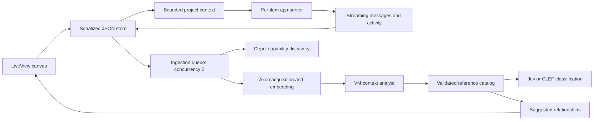

# Architecture

LiveView owns the inspector and event handling. A JavaScript hook renders the spatial canvas using DOM cards and SVG edges. Phoenix PubSub broadcasts persisted changes to every connected view.

## Boundaries

- `Canvas.Store`: serialized mutations, atomic file replacement, board persistence and PubSub.
- `Canvas.Context`: project-scoped manifests, parent context for dispatched tasks, upload provenance, bounded excerpts.
- `Canvas.Codex.Session`: supervised stdio JSON-RPC, request correlation/timeouts, event parsing, default denial of server-initiated requests.
- `Canvas.Agents`: thread creation/resume, chat, steer, interrupt, VM dispatch, explicit session import.
- `Canvas.Ingestion`: bounded worker queue, stage tracking, reference synthesis and source-ID validation.
- `Canvas.Integrations.Axon`: synchronous source/upload REST contract and embedding receipt validation.
- `Canvas.Integrations.Depot`: MCP initialization and bounded gateway capability discovery.
- `Canvas.DecisionModels.SystemOne`: Jev/CLEF typed answer normalization with uncertainty retained.

The catalog scaffold records source locations before analysis finishes. Agent-written claims remain visibly separate from ingestion receipts and classification. Accepted relationships are persisted edges. Cortex, VM provisioning, durable job recovery, authentication, and multi-user storage remain future implementation.
